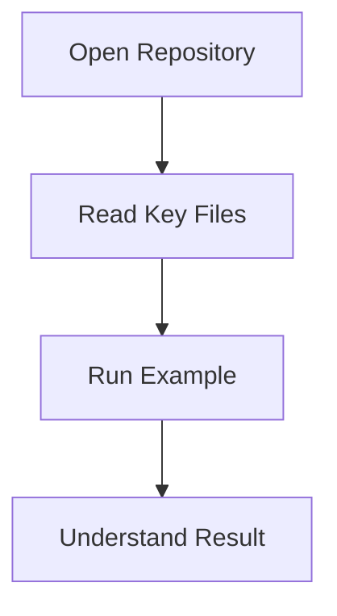

# Onboarding Template

Use this template for final onboarding docs.

## 1. Repository Purpose
- What this repository does.
- Who should use it.

## 2. Structure Summary
- Top-level directories and key files.
- What each major area is responsible for.

## 3. Quick Start
- Prerequisites.
- Setup commands.
- Run and test commands.

## 4. Beginner-Friendly Example
- Example name and location.
- Why it is a good first example.

## 5. Step-by-Step Walkthrough
1. Step one.
2. Step two.
3. Step three.

## 6. Mermaid Diagram

## 7. Next Learning Steps
- What to explore next.
- Common pitfalls.
